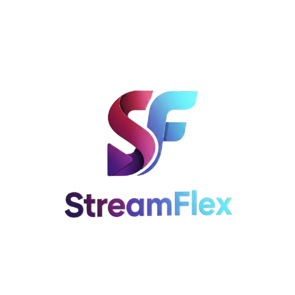

# 🎬 Stream Flex - Netflix Clone

A modern Netflix-inspired movie discovery and management platform built with Next.js 16, React 19, and TypeScript. This application integrates with TMDB (The Movie Database) API to provide real-time movie data, trending content, search functionality, and a personal favorites list.



## ✨ Features

### Core Functionality
- 🎥 **Movie Discovery** - Browse trending, popular, and top-rated movies
- 🔍 **Real-time Search** - Search movies with debounced API calls
- ❤️ **Favorites List** - Add/remove movies to your personal collection
- 📄 **Movie Details** - View comprehensive movie information
- 📱 **Responsive Design** - Works seamlessly on all device sizes

### UI/UX Highlights
- 🌙 **Dark Theme** - Modern dark UI inspired by streaming platforms
- ✨ **Smooth Animations** - Framer Motion animations and transitions
- 🎠 **Auto-scrolling Carousel** - Animated movie poster display on homepage
- 🎯 **Hover Effects** - Interactive movie cards with visual feedback
- 📊 **Loading States** - Skeleton loaders during data fetching
- ⚠️ **Error Handling** - User-friendly error messages

## 🛠️ Tech Stack

| Technology | Version | Purpose |
|------------|---------|---------|
| **Next.js** | 16.1.1 | React framework with App Router |
| **React** | 19.2.3 | UI component library |
| **TypeScript** | 5 | Type safety |
| **Tailwind CSS** | 4 | Utility-first styling |
| **Framer Motion** | 12.26.2 | Animation library |
| **Lucide React** | 0.562.0 | Icon set |
| **TMDB API** | v3 | Movie data source |

## 📁 Project Structure

```
netflix-clone/
├── app/                          # Next.js App Router pages
│   ├── globals.css              # Global styles
│   ├── layout.tsx               # Root layout with providers
│   ├── page.tsx                 # Homepage
│   ├── about/
│   │   └── page.tsx             # About page
│   ├── list/
│   │   └── page.tsx             # Favorites list page
│   ├── search/
│   │   └── page.tsx             # Search functionality
│   └── movie/
│       └── [id]/
│           └── page.tsx         # Dynamic movie detail page
├── public/                       # Static assets
│   └── image/                    # Movie posters & logo
├── src/                          # Source code
│   ├── Api/
│   │   └── Api.tsx              # TMDB API configuration
│   ├── Button.tsx               # Watch button component
│   ├── FavoriteBtn.tsx          # Favorite toggle button
│   ├── HotSearching.tsx         # Popular movies section
│   ├── HotSection.tsx           # Top-rated movies section
│   ├── Trending.tsx             # Trending movies section
│   ├── Components/
│   │   ├── Header.tsx           # Navigation header
│   │   └── Line.tsx             # Decorative line component
│   ├── Context/
│   │   ├── ListContext.tsx      # Favorites context definition
│   │   └── ListProvider.tsx     # Favorites state management
│   └── types/
│       └── movie.ts             # TypeScript interfaces
├── next.config.ts               # Next.js configuration
├── package.json                 # Project dependencies
├── tsconfig.json                # TypeScript configuration
└── tailwind.config.ts           # Tailwind CSS configuration
```

## 🚀 Getting Started

### Prerequisites

- Node.js 18.0 or later
- npm, yarn, or pnpm
- TMDB API key (free from [themoviedb.org](https://www.themoviedb.org/documentation/api))

### Installation

1. **Clone the repository**
   ```bash
   git clone <repository-url>
   cd netflix-clone
   ```

2. **Install dependencies**
   ```bash
   npm install
   # or
   yarn install
   # or
   pnpm install
   ```

3. **Set up environment variables**
   Create a `.env.local` file in the root directory:
   ```env
   NEXT_PUBLIC_TMDB_API_KEY=your_api_key_here
   NEXT_PUBLIC_TMDB_BASE_URL=https://api.themoviedb.org/3
   ```

   > ⚠️ Get your free TMDB API key from [The Movie Database](https://www.themoviedb.org/settings/api)

4. **Run the development server**
   ```bash
   npm run dev
   # or
   yarn dev
   # or
   pnpm dev
   ```

5. **Open your browser**
   Navigate to [http://localhost:3000](http://localhost:3000)

## 📱 Pages & Features

### 🏠 Home Page (`/`)
- Animated movie poster carousel
- **Trending Now** - Weekly trending movies
- **Hot Searching** - Currently popular movies
- **High Score Featured** - Top-rated movies

### 🔍 Search Page (`/search`)
- Real-time movie search with 500ms debounce
- Grid display of search results
- Movie posters and titles
- Empty state handling

### 🎬 Movie Details Page (`/movie/[id]`)
- Full movie information
- High-quality poster
- Movie overview and release date
- Watch and Favorite buttons
- Loading skeleton
- Error handling

### ❤️ My List Page (`/list`)
- Persistent favorites stored in localStorage
- Horizontal scrolling list
- Remove movies from favorites
- Empty state when no favorites

### ℹ️ About Page (`/about`)
- Project information
- Feature descriptions
- Technology stack overview

## 🔧 Configuration

### TMDB API Setup

The application uses TMDB API endpoints:
- `/trending/movie/week` - Trending movies
- `/movie/popular` - Popular movies
- `/movie/top_rated` - Top-rated movies
- `/movie/{id}` - Movie details
- `/search/movie` - Movie search

### Image Configuration

External images from TMDB are allowed in `next.config.ts`:
```typescript
images: {
  domains: ["image.tmdb.org"],
}
```

## 🎨 Design System

### Color Palette
- **Background**: Dark (#121212)
- **Primary**: Gradient (#A2226E → #00E5FF)
- **Text**: White and gray variations
- **Accents**: Red (favorites), Yellow (ratings)

### Typography
- **Font**: System fonts via Tailwind
- **Weights**: Regular, Medium, Bold, Extra Bold

### Components
- **Cards**: Rounded corners, shadows, hover animations
- **Buttons**: Glassmorphism with backdrop blur
- **Loading**: Skeleton screens with pulse animation
- **Scrollbar**: Hidden scrollbars for horizontal lists

## 📦 Key Dependencies

```json
{
  "dependencies": {
    "next": "16.1.1",
    "react": "19.2.3",
    "react-dom": "19.2.3",
    "framer-motion": "^12.26.2",
    "lucide-react": "^0.562.0"
  },
  "devDependencies": {
    "typescript": "^5",
    "tailwindcss": "^4",
    "@types/react": "^19",
    "@types/node": "^20"
  }
}
```

## 🧪 Scripts

```bash
# Development server
npm run dev

# Build for production
npm run build

# Start production server
npm run start

# Run ESLint
npm run lint
```

## 🔐 Environment Variables

| Variable | Description | Required |
|----------|-------------|----------|
| `NEXT_PUBLIC_TMDB_API_KEY` | Your TMDB API key | Yes |
| `NEXT_PUBLIC_TMDB_BASE_URL` | TMDB API base URL | No (default provided) |

## 🤝 Contributing

1. Fork the repository
2. Create your feature branch (`git checkout -b feature/AmazingFeature`)
3. Commit your changes (`git commit -m 'Add some AmazingFeature'`)
4. Push to the branch (`git push origin feature/AmazingFeature`)
5. Open a Pull Request

## 📄 License

This project is for educational purposes. Movie data is provided by [TMDB](https://www.themoviedb.org/).

## 🙏 Acknowledgments

- [The Movie Database (TMDB)](https://www.themoviedb.org/) for the API
- [Next.js](https://nextjs.org/) team for the framework
- [Tailwind CSS](https://tailwindcss.com/) for the styling
- [Framer Motion](https://www.framer.com/motion/) for animations
- [Lucide](https://lucide.dev/) for icons

---

Built with ❤️ for movie lovers

